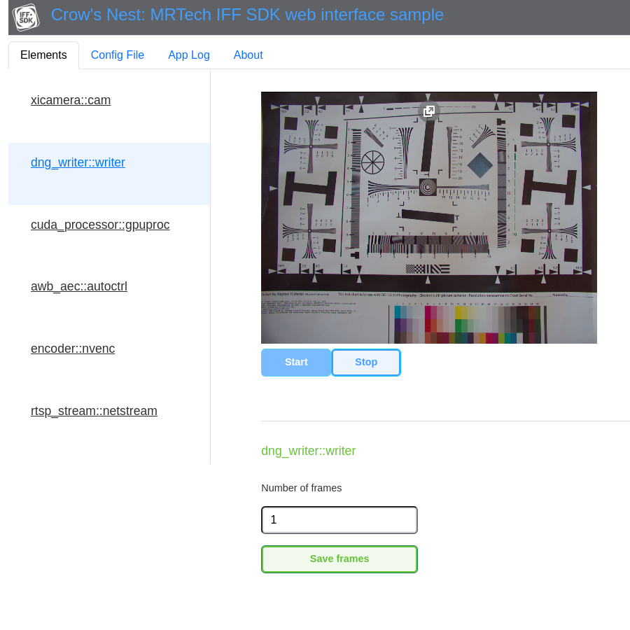

# `crowsnest`

Web interface sample called `crowsnest` demonstrates the possibility to control runtime parameters of IFF SDK pipeline and preview the video stream through an ordinary web browser.
It is located in `samples/03_webrtc` directory of IFF SDK package.
Web application code is based on [Vue.js](https://vuejs.org/) framework.
[Janus](https://janus-legacy.conf.meetecho.com/) server is used to convert RTSP stream (as provided by IFF SDK) to WebRTC protocol supported by modern web browsers.
[nginx](https://nginx.org/) server is a standard solution to serve the web interface and proxy connections to IFF SDK and Janus control interface.
[`farsight`](https://github.com/mr-technologies/farsight) sample application can be used to run a compatible IFF SDK pipeline.
User interface is self-documented in "About" tab of the presented web page.

## Installation

`linux/install.sh` installation script is provided as a reference.
It was tested on NVIDIA Jetson platform with L4T 32.7 operating system.
On success it prints out instructions for final setup steps.

## Deployment of modifications

The following commands should be used to deploy changes made to web interface source code (assuming default installation configuration as described above):

```sh
export PATH=/opt/mrtech/bin:"$PATH"
npm run build
cp -RT dist/ /opt/mrtech/var/www/html/
```
